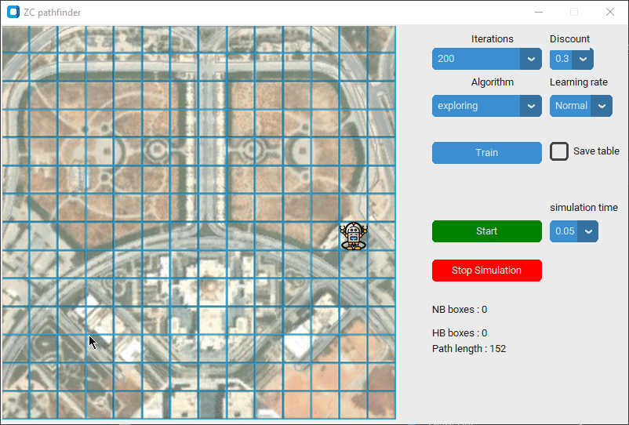

# ZC Navigator

## About
- This was a university project for Artificial intelligence course. 
- This was an implementation for reinforcement learning to simulate training a robot moving boxes to target locations


## Screenshots


## How to run
- install the requirements using 
```bash
 pip install -r requirements.txt
```
- Run using 
```bash
python main.py
```


## Contributors
- [Ezzat Eisawy](https://github.com/EzzatEsam)
- [Mahmoud El-Bahnasawi](https://github.com/El-Bahnasawi)

## License
This project is licensed under the MIT License - see the [LICENSE](LICENSE) file for details


